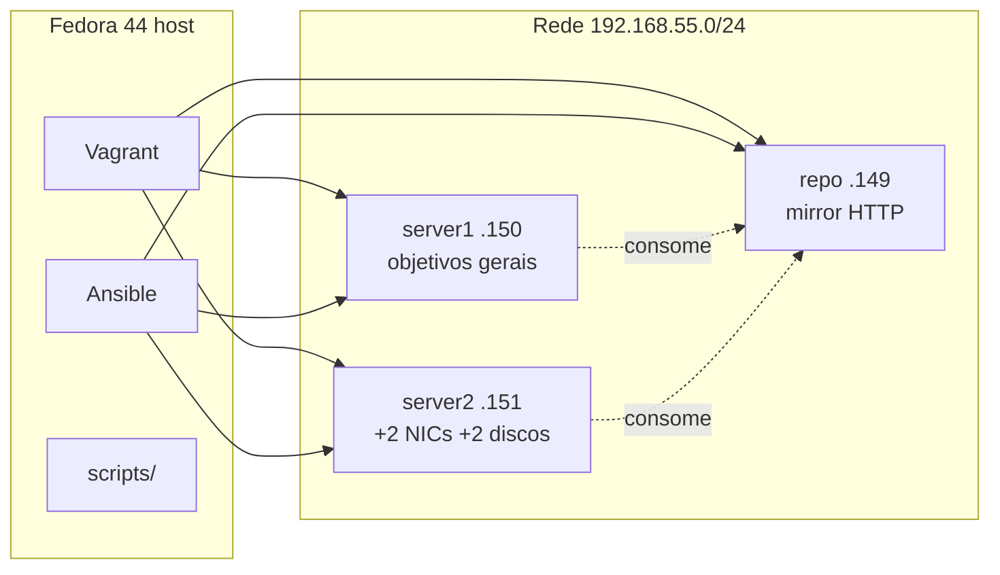

# Ambiente de prática RHCSA 9 (RHEL 9)

Laboratório local para estudo do **RHCSA** alinhado aos objetivos do **RHEL 9**, usando **CentOS Stream 9** nas VMs (equivalente comunitário próximo ao RHEL 9) e **Fedora 44** apenas como host (hypervisor + Ansible).

Orquestração: **Vagrant** + **libvirt/KVM** (padrão no Fedora) ou **VirtualBox** + **Ansible**.

---

## Visão geral (o que este projeto prepara)

Laboratório **local e repetível** que imita o tipo de cenário do exame **RHCSA em RHEL 9**: dois servidores de trabalho sem Internet nem repos configurados, e um servidor de repositório na rede interna com `BaseOS` e `AppStream` servidos por HTTP — como no material Red Hat, mas usando **CentOS Stream 9** nas VMs e **Fedora 44** só como máquina host.



| Componente | Função no estudo |
|------------|------------------|
| **repo** | Espelha pacotes CentOS Stream 9 (`reposync`), publica `http://repo/.../BaseOS` e `AppStream`, corre `httpd` e `firewalld` |
| **server1** | “Máquina A” do exame: IP fixo, `httpd` instalado via repo offline, **sem** ficheiros em `/etc/yum.repos.d`, SELinux **enforcing**, senhas do lab |
| **server2** | “Máquina B”: igual ao server1 no baseline, mais **duas NICs** extras e **dois discos** de 16 GiB (`/extradisk1`, `/extradisk2`) para tarefas de storage/partições |
| **Ansible** | Configuração inicial (`master.yml`) e **reset** após simulados (`reset.yml`) |
| **Scripts** | Subir o lab, verificar saúde, reset e SSH opcional — sem memorizar dezenas de comandos |

**O que não é:** curso, simulado com enunciado nem certificação — é só **infraestrutura** pronta para praticar objetivos RHCSA (users, LVM, rede, SELinux, containers, etc.) em VMs parecidas com o exame.

**Fluxo típico:** `setup-host-fedora44.sh` (uma vez) → `lab-up.sh` → estudar em server1/server2 usando o repo → `lab-reset.sh` → repetir.

**Prática EX200 (enunciado em inglês, validação em português):** pasta [practice/](practice/) — `./scripts/lab-practice.sh list`

---

## Objetivo

Simular o cenário de exame (dois servidores + repositório offline `BaseOS`/`AppStream`) sem assinatura RHEL, com pacotes e layout compatíveis com a trilha **RHEL 9.0**.

| Papel | Hostname | IP (rede do lab, eth1) |
|--------|----------|-------------------------|
| Repo | `repo.nine.example.com` | 192.168.55.149 |
| Server 1 | `server1.nine.example.com` | 192.168.55.150 |
| Server 2 | `server2.nine.example.com` | 192.168.55.151 |

**Box Vagrant:** `generic/centos9s` (CentOS Stream 9)

Repositório HTTP local (após o primeiro `reposync`):

- `http://repo.nine.example.com/BaseOS`
- `http://repo.nine.example.com/AppStream`

---

## Pré-requisitos (Fedora 44)

- CPU com virtualização (Intel VT-x / AMD-V) habilitada na firmware
- ~30 GB de disco livre (mirror do repo na primeira subida)
- Acesso à Internet na primeira execução (sincronização do repo)

### Instalação do host (uma vez)

```bash
sudo ./scripts/setup-host-fedora44.sh
chmod +x scripts/*.sh
```

O script instala **Vagrant**, **vagrant-libvirt**, **Ansible**, **libvirt** e (opcional) **VirtualBox**.

```bash
vagrant plugin list   # deve incluir vagrant-libvirt
virsh -c qemu:///system list --all
```

**Server 2** recebe dois discos extras de 16 GiB (`vdb`/`vdc` no libvirt, `sdb`/`sdc` no VirtualBox).

---

## Scripts do lab (`./scripts/`)

| Script | Descrição |
|--------|-----------|
| `setup-host-fedora44.sh` | Instala dependências no Fedora (uma vez) |
| `lab-up.sh` | Sobe **repo** → **server2** → **server1** na ordem correta |
| `lab-health.sh` | Checagens automatizadas (igual à tabela em [Comandos úteis](#comandos-úteis-vagrant--manutenção)); exit 0 = saudável |
| `lab-reset.sh` | Wrapper de `playbooks/reset.yml` (server1 + server2; não repõe o repo) |
| `lab-ssh-config.sh` | Gera blocos SSH; `--install` grava em `~/.ssh/config` |
| `lab-practice.sh` | Lista/valida exercícios em `practice/exercises/` |

### Subir o lab

```bash
./scripts/lab-up.sh
```

Ordem manual equivalente:

```bash
vagrant up repo
vagrant up server2
vagrant up server1
```

### Verificar saúde

```bash
./scripts/lab-health.sh
```

Inclui `lsblk` em **server2** (discos `vdb`/`vdc` e montagens `/extradisk1`, `/extradisk2`).

### Reset após simulado de exame

```bash
./scripts/lab-reset.sh
```

Equivalente a `ansible-playbook playbooks/reset.yml`. Os servidores reiniciam no final.

### SSH direto (opcional)

O `ssh vagrant@192.168.55.150` **falha** sem a chave do Vagrant. Prefira `vagrant ssh server1` ou configure o SSH:

```bash
./scripts/lab-ssh-config.sh              # ver blocos gerados
./scripts/lab-ssh-config.sh --write      # grava .ssh-config/rhcsa9-lab.conf
./scripts/lab-ssh-config.sh --install    # acrescenta a ~/.ssh/config
```

Depois:

```bash
ssh rhcsa9-server1          # IP do exame 192.168.55.150
ssh rhcsa9-server1-mgmt     # IP de gestão libvirt (vagrant ssh-config)
ssh rhcsa9-repo
ssh rhcsa9-server2
```

### Primeira execução

1. Download da box `generic/centos9s`.
2. **Repo:** `dnf reposync` + pacotes bootstrap — pode levar **30–90 minutos**.
3. **Server 2:** discos extras (`scripts/provision-server2-disks.sh` via Vagrant).
4. **Server 1:** Ansible `master.yml` (repo + servers) e reinício.

---

## Acesso às VMs

| Conta | Senha |
|--------|--------|
| `vagrant` | `vagrant` |
| `root` | `password` (via `sudo` / `sudo su -`) |

```bash
vagrant ssh server1
vagrant ssh server2
vagrant ssh repo
```

Opcional no `/etc/hosts` do Fedora:

```ini
192.168.55.149 repo.nine.example.com repo
192.168.55.150 server1.nine.example.com server1
192.168.55.151 server2.nine.example.com server2
```

**Server 2:** NICs extras `192.168.55.175`, `192.168.55.176`; discos `/extradisk1`, `/extradisk2`.

---

## Comandos úteis (Vagrant / manutenção)

### Scripts (`./scripts/`)

| Comando | O que faz de facto |
|---------|-------------------|
| `./scripts/lab-up.sh` | `vagrant up repo`, depois `server2`, depois `server1` (ordem recomendada no primeiro deploy) |
| `./scripts/lab-health.sh` | Corre checagens nas 3 VMs (estado Vagrant, IP `192.168.55.x`, `repomd.xml`, `httpd`, repos vazios em server1/2, `lsblk`/extradiscos); termina com código 0 ou 1 |
| `./scripts/lab-reset.sh` | Executa `ansible-playbook playbooks/reset.yml` — repõe **server1** e **server2** (não altera o **repo**); reinicia os dois no final |
| `./scripts/lab-ssh-config.sh --install` | Adiciona entradas `rhcsa9-*` em `~/.ssh/config` (chave Vagrant + IP do exame e IP de gestão libvirt) |

### Vagrant — estado e ciclo de vida

| Comando | O que faz de facto |
|---------|-------------------|
| `vagrant status` | Lista `repo`, `server1`, `server2` e o estado (`running`, `poweroff`, etc.) |
| `vagrant halt` | Desliga **todas** as VMs do projeto (dados dos discos mantêm-se) |
| `vagrant destroy -f` | Apaga **todas** as VMs e o estado Vagrant (discos libvirt no pool `default` / ficheiros `disk-*.vdi` no projeto podem ficar) |
| `vagrant destroy -f server2 && vagrant up server2` | Recria só **server2** (inclui discos `vdb`/`vdc` no libvirt); corre apenas o provisioner **shell** dos discos — para reaplicar Ansible em server2 use `vagrant provision server1` |

### Vagrant — provision (reconfigurar sem destruir)

| Comando | O que faz de facto |
|---------|-------------------|
| `vagrant provision repo` | Shell (`sshpass`) + Ansible `playbooks/repo.yml` na VM **repo** (mirror, `httpd`, firewalld, symlinks `BaseOS`/`AppStream`) |
| `vagrant provision server1` | Ansible `playbooks/master.yml` (`repo.yml` → `server1.yml` → `server2.yml` → `welcome.yml`) em **repo**, **server1** e **server2**; no fim **reboot** de server1 (`run: always`) |
| `vagrant provision server2` | Apenas `scripts/provision-server2-disks.sh` (formatar/montar `/extradisk1` e `/extradisk2`) — **não** corre `server2.yml` |

Equivalente Ansible só em server2 (com VMs já no ar): `ansible-playbook playbooks/server2.yml`.

### Inspeção rápida nas guests

| Comando | O que faz de facto |
|---------|-------------------|
| `vagrant ssh server1` | Sessão interativa em server1 (rede de gestão Vagrant; não usa `192.168.55.150` diretamente) |
| `vagrant ssh server2 -c 'lsblk'` | Lista discos (`vda`, `vdb`, `vdc`) e montagens (`/extradisk1`, `/extradisk2`) |
| `vagrant ssh server1 -c 'rpm -q httpd; systemctl is-active httpd; ls /etc/yum.repos.d'` | Confirma `httpd` instalado/ativo e diretório de repos vazio (cenário de exame) |
| `vagrant ssh server2 -c 'rpm -q httpd man-pages'` | Confirma pacotes baseline instalados antes de apagar os `.repo` |
| `vagrant ssh repo -c 'curl -sI http://127.0.0.1/BaseOS/repodata/repomd.xml'` | Testa se o mirror HTTP no **repo** devolve cabeçalho (esperado `HTTP/1.1 200`) |

Atualizar o projeto: `git pull`.

---

## Estrutura do projeto

```
scripts/
  lab-up.sh              # deploy ordenado
  lab-health.sh          # checagens
  lab-reset.sh           # reset Ansible
  lab-ssh-config.sh      # SSH opcional
  setup-host-fedora44.sh
  provision-server2-disks.sh
  lib/common.sh
playbooks/
  master.yml             # repo → server1 → server2 → welcome
  repo.yml               # mirror + httpd
  server1.yml / server2.yml
  reset.yml
  tasks/
Vagrantfile
inventory
ansible.cfg
```

O provisioner **Ansible** corre no **host Fedora** (não dentro das VMs).

---

## Diferenças em relação ao RHCSA 8 original

- Domínio: `nine.example.com`
- Guests: **CentOS Stream 9** (`generic/centos9s`)
- Repo: `dnf reposync` + symlinks HTTP + RPMs bootstrap (`httpd`, etc.)
- Provider preferido no Fedora: **libvirt**
- Scripts unificados em `./scripts/`

---

## Problemas conhecidos

**Repo HTTP 404 em `/BaseOS/repodata`**

- `vagrant provision repo` ou `./scripts/lab-health.sh`

**`httpd` / `man-pages` nos servidores**

- `vagrant provision repo` depois `vagrant provision server1`

**Discos extras em server2**

- `vagrant destroy -f server2 && vagrant up server2`
- `vagrant provision server2` se só o shell dos discos falhou

**SSH direto `Permission denied (publickey)`**

- Use `vagrant ssh` ou `./scripts/lab-ssh-config.sh --install`

**Reset e GRUB**

- `reset.yml` restaura `/etc/default/grub.laborig` se existir.

---

## Licença

Ver [LICENSE](LICENSE). Derivado de [rdbreak/rhcsa8env](https://github.com/rdbreak/rhcsa8env), adaptado para RHCSA 9 / CentOS Stream 9 / Fedora 44.
